# Lambton-Transit

Home screen

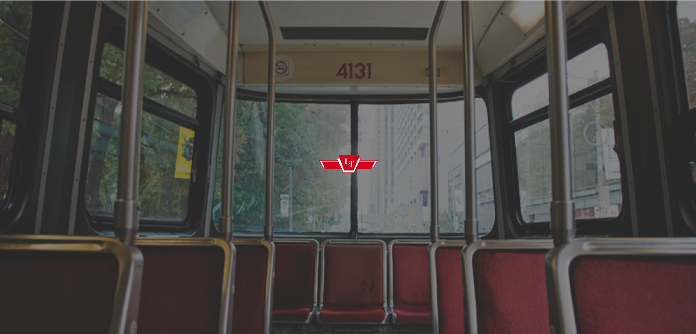

Login screen

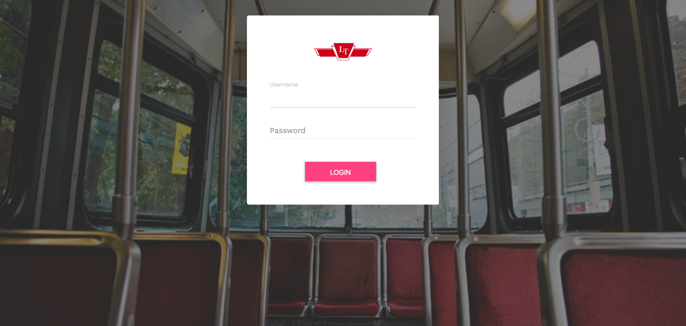

Routes screen : Displays all bus routes

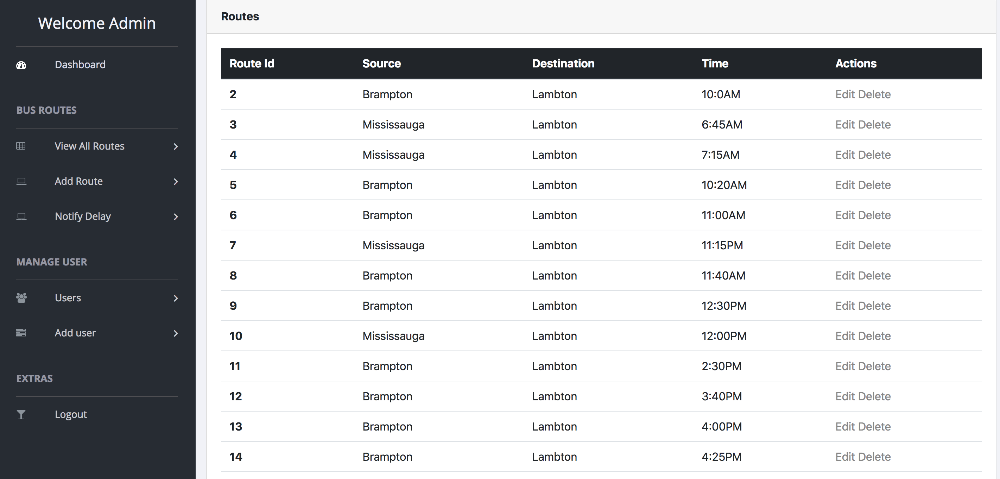

Update Routes screen : Allows the admin to update a route

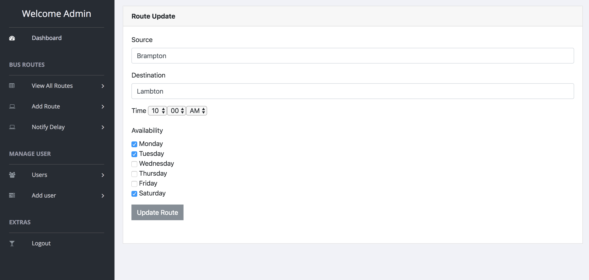

Delete Routes screen : Allows the admin to delete a route

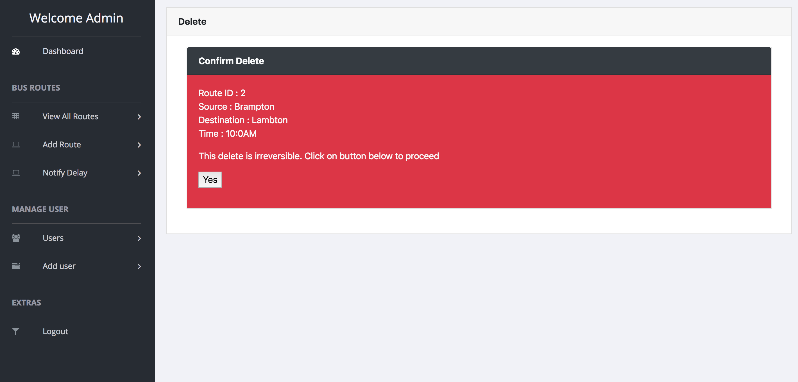

Add Routes screen : Allows the admin to add a route

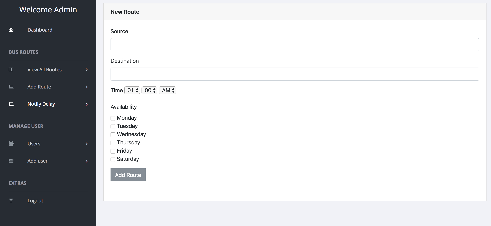

Delay screen : Allows the admin to send the delay notification to the students via sms. This notification can be customized as per admin's convienence

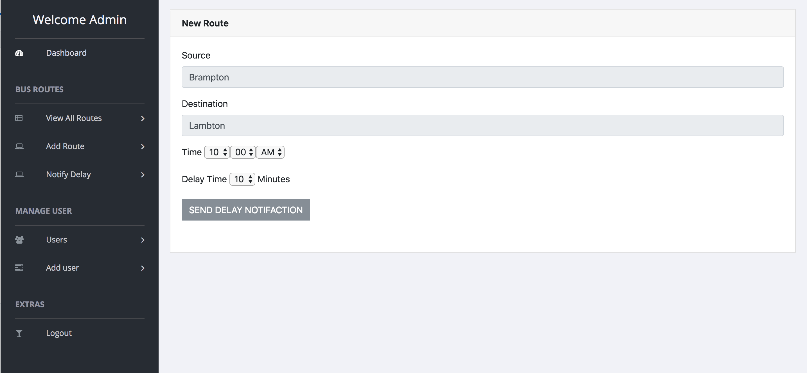

Users screen : Allows the admin to view all Users

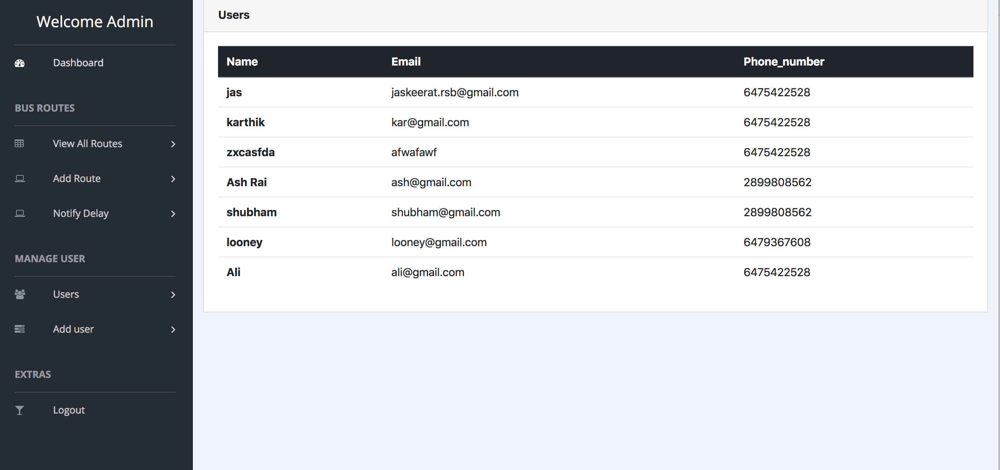

Add User screen : Allows he admin to add a User

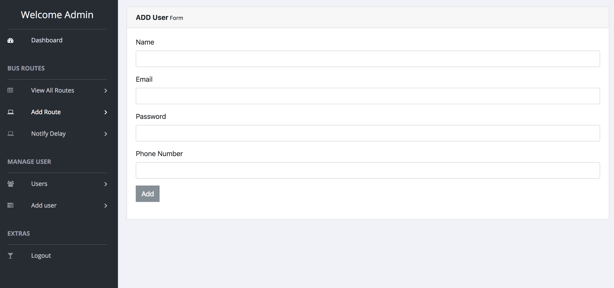

Next Bus screen : Allows the students/users to view the next bus in the schedule

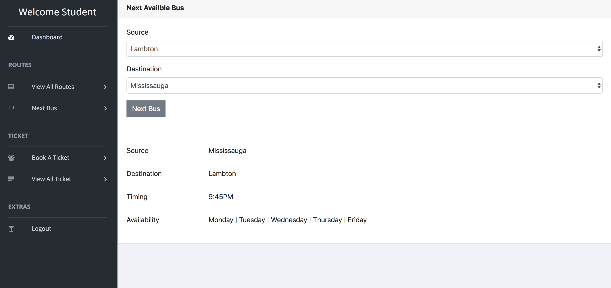

Book Bus screen : Allows the students/users to book a bus ticket

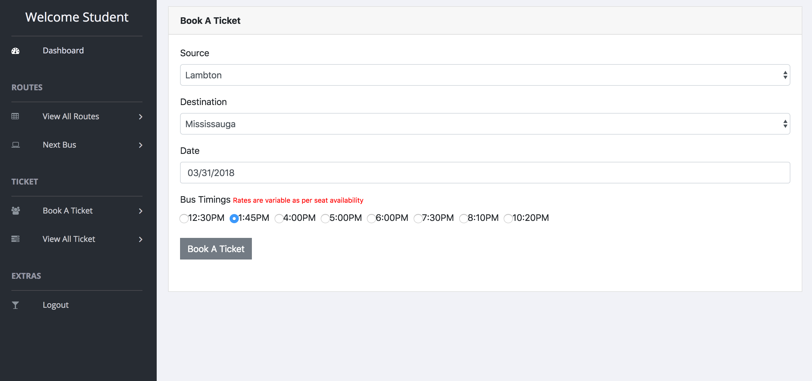

Book Bus screen : Allows the students/users to view thier bar code for the ticket

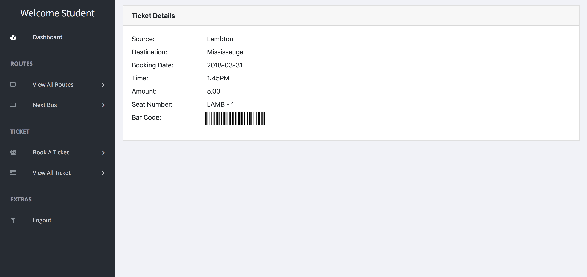

Student Logout screen

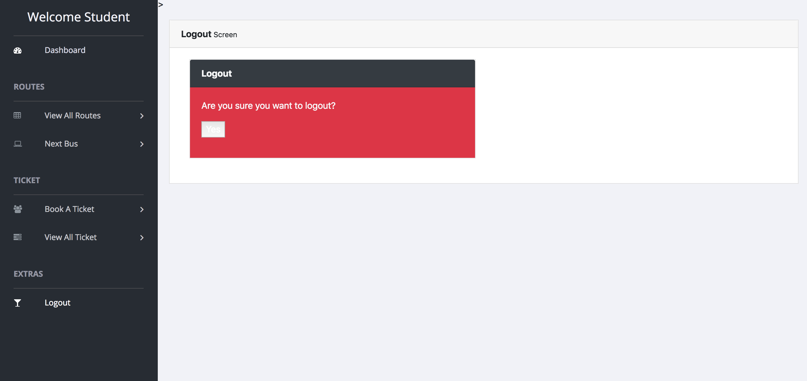
